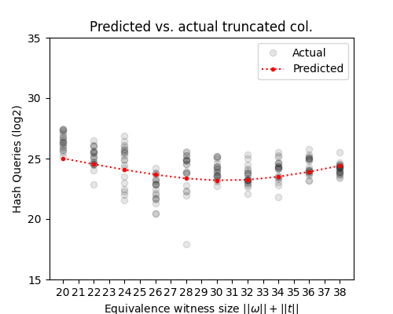

# Collision-Covenants Code

This is the code used to produce some of the figures in our paper "Honey I shrunk the signatures: Covenants in Bitcoin via 160-bit hash collisions".

## Security vs spend cost

run `python3 costfig.py` to produce the graph below. On the left the pre-computation cost needed for different Small Script implementation sizes of RIPEMD-160 and SHA-1 (the sum of both implementations). On right we graph the work in number of graph queries for spend our covenant vs what an attacker would need to be spend to break the covenant.

## Predicted vs Actual

run `python3 colfig.py` to run our collision algorithm on a truncated hash output. It produce the graph below showing how well our equation matches actual runs of our distinguished points collision finding algorithm. We use truncated hash function of 40-bits rather than a full 160-bit hash function to make the work reasonable. This results in significant noise.

The grey dots are actual runs, the red dot is what we predict from our equation.

